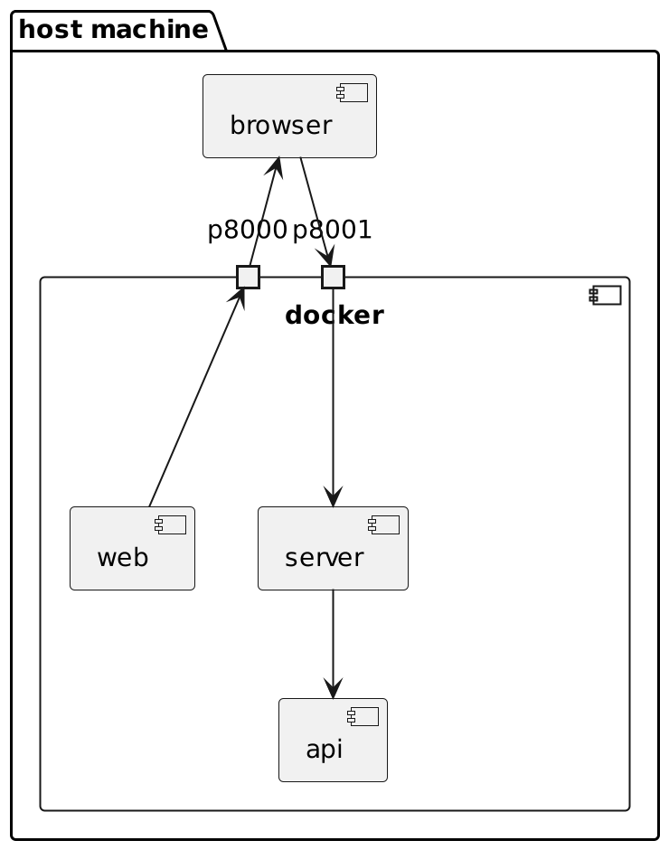

# Practical Docker 101 Workshop
This is the base code containing the web and server application

# Tasks
1. Run both web and server application in local machine
2. Dockerize the web and server application
3. Setup and run both application using `docker compose`
4. Configure simple `networking` using `docker compose`

# Applications
- [web](./web/README.md)
- [server](./server/README.md)
- [api](./api/README.md)

# Architecture
